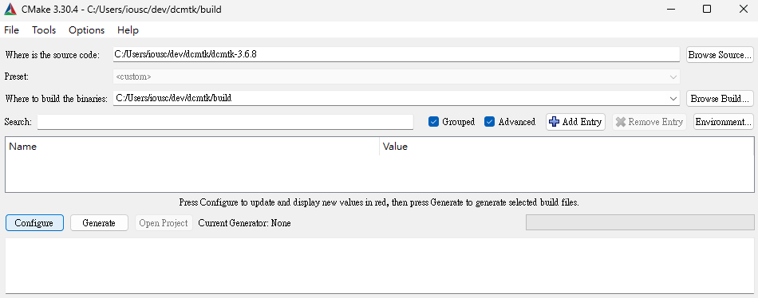
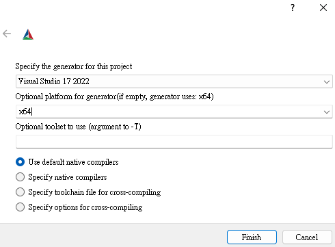
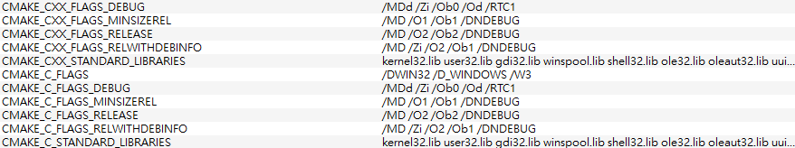
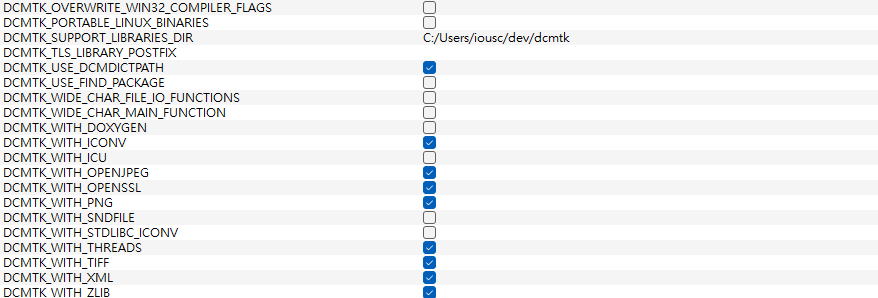
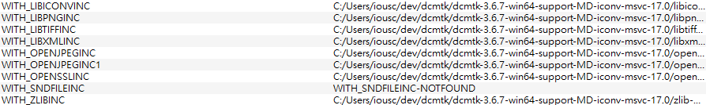
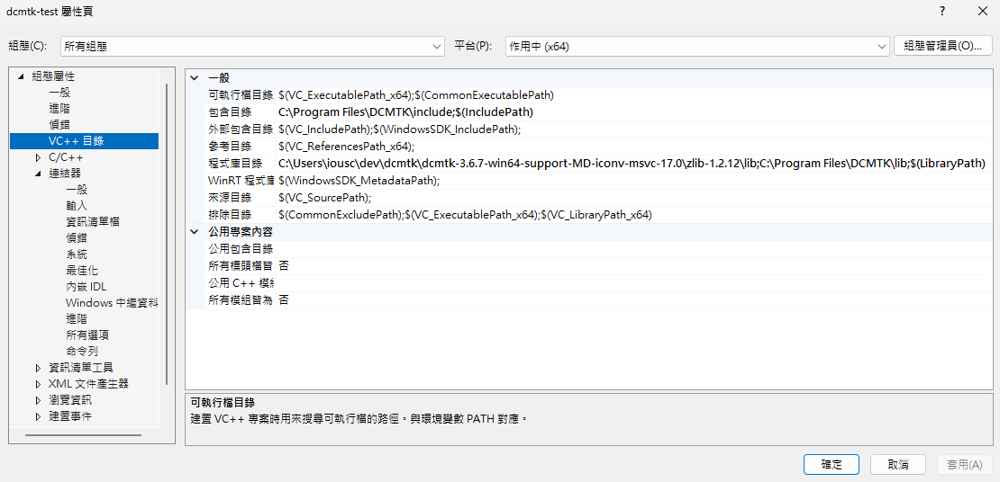
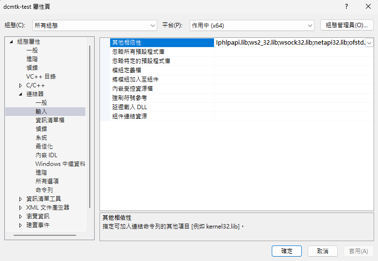

# DCMTK Setup on Windows

This document offers a step-by-step guide for installing DCMTK on a Windows machine.

## Table of Contents

- [DCMTK Setup on Windows](#dcmtk-setup-on-windows)
  - [Table of Contents](#table-of-contents)
  - [Prerequisites](#prerequisites)
    - [Development Tools](#development-tools)
  - [Installation Instructions](#installation-instructions)
  - [Development with DCMTK Libraries](#development-with-dcmtk-libraries)
  - [References](#references)

## Prerequisites
Ensure that you have:
- Administrator privileges on the Windows machine.
- A stable internet connection.

### Development Tools
- Visual Studio 2022.

## Installation Instructions

1. Download and install the latest version of [CMake](https://cmake.org/download/#latest) by selecting the *Windows x64 Installer* binary distribution.
2. Download [DCMTK](https://dicom.offis.de/dcmtk.php.en):
   - Obtain the Source Code and Documentation `DCMTK 3.6.7 Source Code and Documentation` from [dcmtk-3.6.7.zip](https://dicom.offis.de/download/dcmtk/dcmtk367/dcmtk-3.6.7.zip).
   - Obtain the Support Libraries for Windows `Pre-compiled libraries for Visual Studio 2022 (MSVC 17.0), 64 bit, with "MD" option` from [dcmtk-3.6.7-win64-support-MD-iconv-msvc-17.0.zip](https://dicom.offis.de/download/dcmtk/dcmtk367/support/dcmtk-3.6.7-win64-support-MD-iconv-msvc-17.0.zip).
3. Build DCMTK.
   - Open the CMake GUI, locate the source code and build directory, and check the `Grouped` and `Advanced` checkboxes. Then, click on the `Configure` button.
    
   - Set the generator to `Visual Studio 17 2022` and explicitly set the optional platform for generator to `x64`.
    
   - Most parameters can be left as they are, but some must be changed for the project to generate correctly:
     - `CMAKE`: Change the parameters indicating `/MT or /MTd` flags to `/MD and /MDd`.
      
     - `DCMTK`: Uncheck the `DCMTK_OVERWRITE_WIN32_COMPILER_FLAGS` parameter, and check the `DCMTK_WITH_ICONV`, `DCMTK_WITH_OPENJPEG`, `DCMTK_WITH_OPENSSL`, `DCMTK_WITH_PNG`, `DCMTK_WITH_TIFF`, `DCMTK_WITH_XML`, and `DCMTK_WITH_ZLIB` parameters.
      
     - `WITH`: Link the parameters `WITH_LIBICONVINC`, `WITH_LIBPNGINC`, `WITH_LIBTIFFINC`, `WITH_LIBXMLINC`, `WITH_OPENJPEGINC`, `WITH_OPENSSLINC`, and `WITH_ZLIBINC` to their respective locations.
      
   - Click on the `Configure` button.
   - Once the process is finished, click on the `Generate` button.
   - Open the generated Visual Studio solution `DCMTK.sln` with administrator privileges.
   - Build the `DCMTK` solution.
   - Build the `INSTALL` package.

## Development with DCMTK Libraries
1. Create a `C++ Console App`.
2. Configure project properties.
   - `VC++ Directories`.
    
     - $\rightarrow$ `Include Directories`: add `C:\Program Files\DCMTK\lib`.
     - $\rightarrow$ `Library Directories`: add `C:\Users\iousc\dev\dcmtk\dcmtk-3.6.7-win64-support-MD-iconv-msvc-17.0\zlib-1.2.12\lib` and `C:\Program Files\DCMTK\lib`.
   - `Linker` $\rightarrow$ `Input`.
    
     - $\rightarrow$ `Additional Dependencies`: add the following:
        ```
        Iphlpapi.lib
        ws2_32.lib
        wsock32.lib
        netapi32.lib
        ofstd.lib
        oflog.lib
        dcmdata.lib
        dcmdsig.lib
        dcmnet.lib
        dcmsr.lib
        dcmimgle.lib
        dcmqrdb.lib
        dcmtls.lib
        dcmwlm.lib
        dcmpstat.lib
        dcmjpls.lib
        dcmjpeg.lib
        dcmimage.lib
        ijg8.lib
        ijg12.lib
        ijg16.lib
        i2d.lib
        zlib_d.lib
        ```
3. temp

## References

[1] [Setup DCMTK with CMake for C++ and Visual Studio 2019 development](https://brandres.medium.com/setup-dcmtk-with-cmake-for-c-and-visual-studio-2019-development-c5b3a40c9a54).

[2] [Building a simple DICOM application with C++ and DCMTK, in Visual Studio 2019](https://brandres.medium.com/building-a-simple-dicom-application-with-c-and-dcmtk-in-visual-studio-2019-5aacc1e0854e). 
